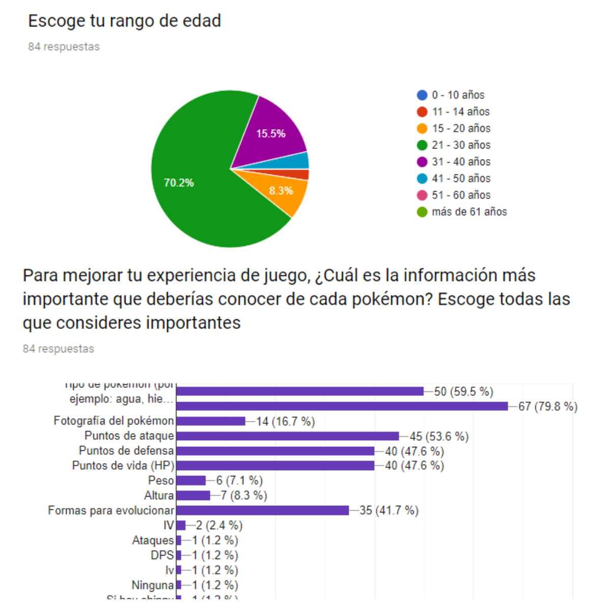
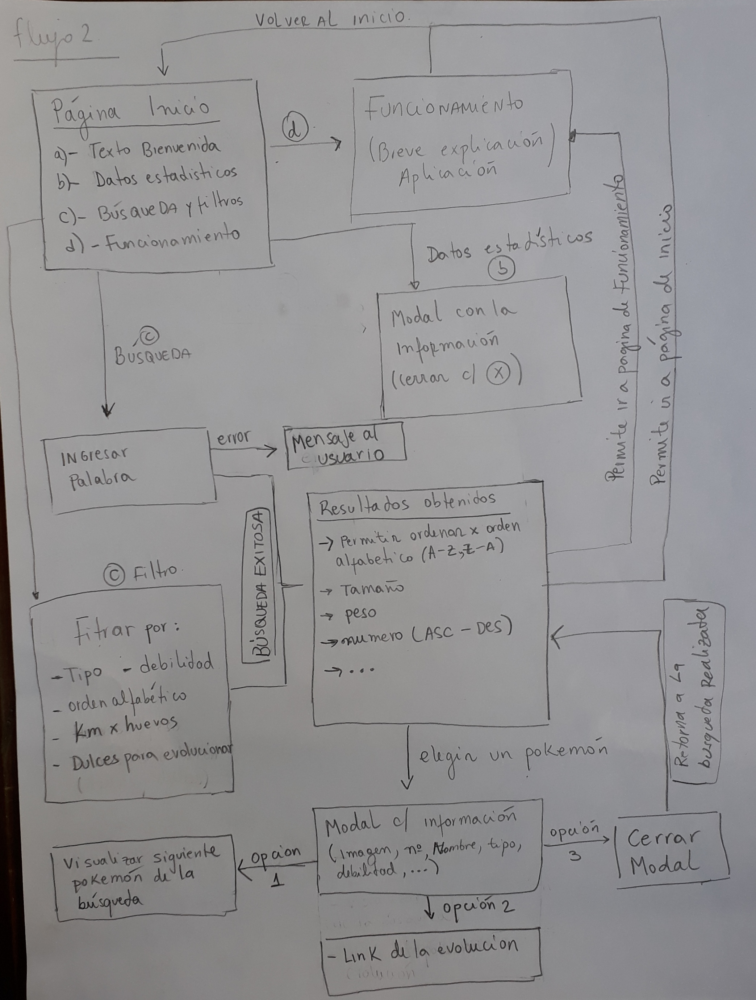
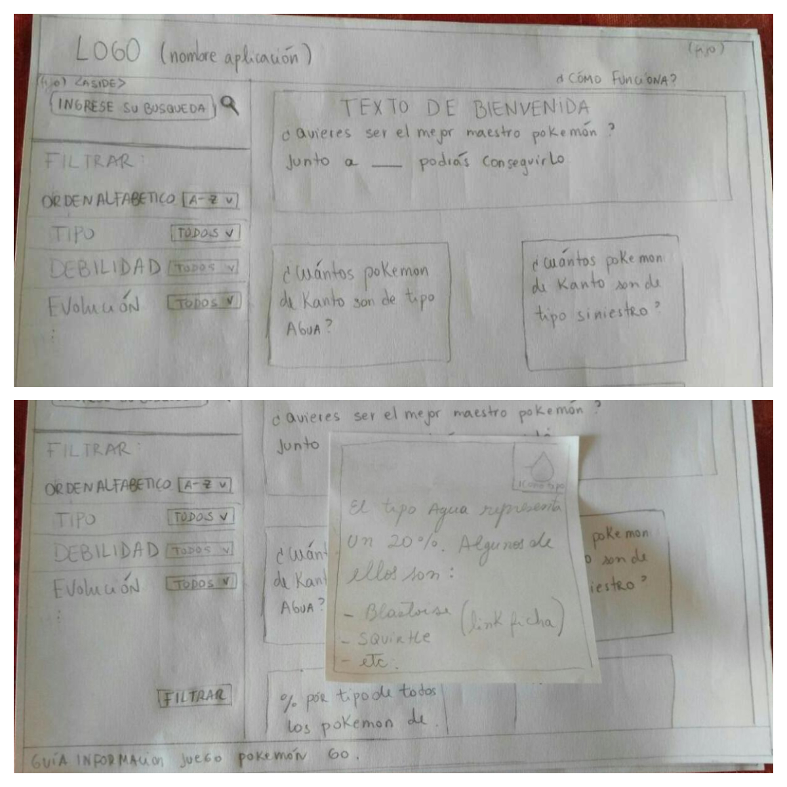
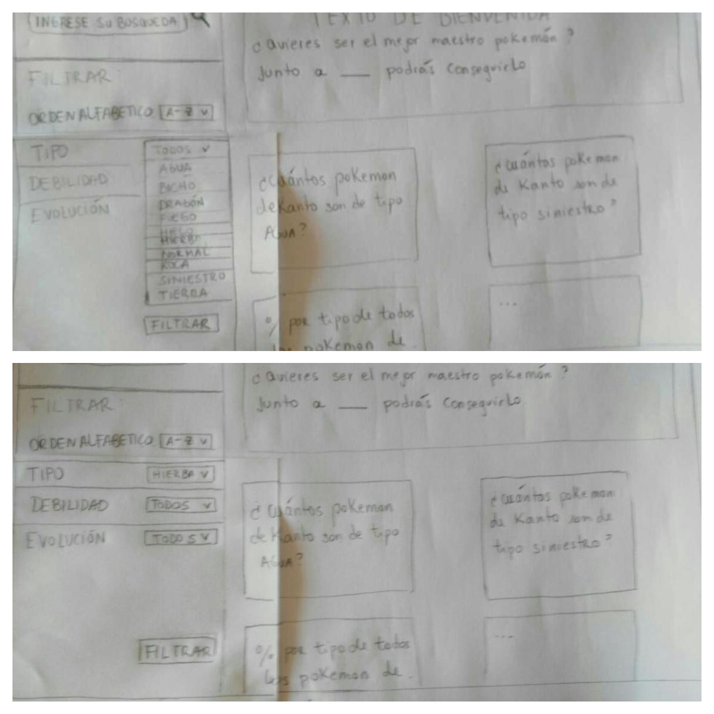
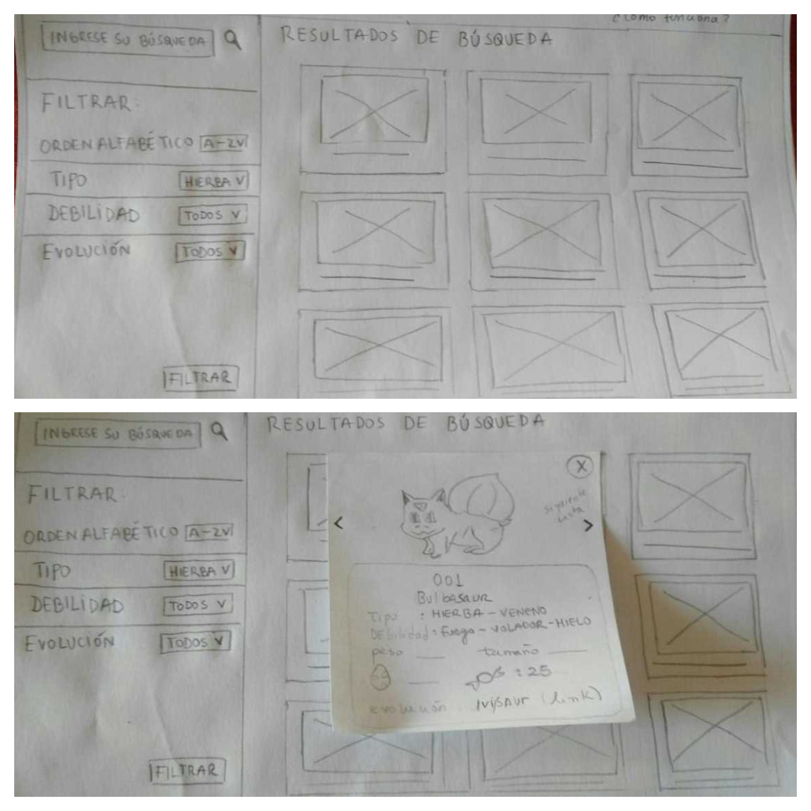
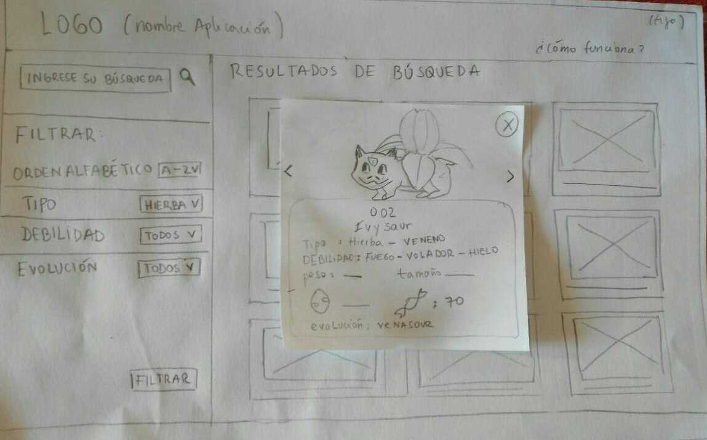
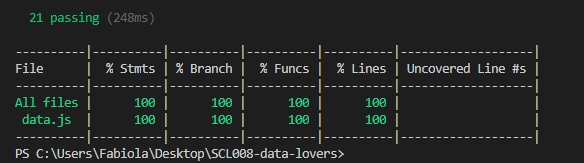

# PokeChoose 

## ¿Qué es PokeChoose? 

Nace como una aplicación web que busca simular una enciclopedia virtual. [PokeChoose](https://faog.github.io/SCL008-data-lovers/src/index.html)  agrupa información de los Pokémon y  le permite al usuario adentrarse en su mundo para conocer en detalle a cada uno de la Región de Kanto.  

Para trabajar bajo los estándares de la industria, se propone el desarrollo de un producto que se encuentre centrado en el público objetivo y que busque la adaptabilidad a sus necesidades y requerimientos. 

## Planificación 🚀

La planificación del trabajo comienza con la elección de una amplia data de la ya conocida y millones de veces descargada aplicación [Pokémon Go](https://www.pokemongo.com/es-es/). Para que esa gran cantidad de información contenida en la data sea atractiva y utilizable por los usuarios se propuso filtrarla y ordenarla de una manera amigable para quienes visiten nuestra aplicación web.

### Definición: ¿Quién es nuestro usuario? 

Lo primero y esencial es conocer al usuario. Para ello se realizó una [encuesta](https://docs.google.com/forms/d/1tS5dteTqStz4BMEkpbQ3pghEVAidVwr08N6nTFHm-xY/edit) en la que se pudo identificar las siguientes [respuestas](https://drive.google.com/file/d/1nwkNuqA18Amx-N_uXer230QfavxjX2rg/view?usp=sharing) : 

* La encuesta tuvo un alcance de 84 personas.
* Rango de edad de nuestros usuarios: 70,2% tienen entre 21-30 años.
* El 83,3% disfruta de coleccionar Pokémon, por lo que conocer en profundidad las características  de cada uno es de gran utilidad para mejorar su experiencia.  
* Cuáles son los datos de interés que desean conocer sobre Pokémon: tipo de Pokémon y sus debilidades. 
* Qué es lo que esperan de una enciclopedia de Pokémon Go. 
* Qué tan necesario sería para ell@s añadir información explicativa del uso de la aplicación.

 
### 1° Fase de Prototipado 📋

Una vez reconocido el usuario, comienza el proceso creativo compuesto por diferentes pasos que buscan dar con un resultado esperado por nosotras, pero principalmente pensado para el usuario. 

* Diagrama de flujo: esquema que grafica el flujo que debería tener la aplicación, considerando cambios de interfaces y filtración de información. 

### Planificación mediante Historias de Usuario ([Trello](https://trello.com/b/7jlIokTT/data-lovers))

**¿Cuál es la necesidad de nuestro usuario?**

A partir de la encuesta realizada nacen distintas historias de usuario (**HU**)  que describen las necesidades de los usuarios, buscando cubrirlas a partir de los criterios de aceptación (**CA**) que se desarrollan en cada una de ellas.

A medida que se desarrolló PokeChoose se encontraron nuevas HU que permitieron generar una página completa y dinámica. 

1. **HU1**: Yo como jugador principiante de Pokémon Go quiero ocupar esta aplicación desde mi computador para poder acceder a la información desde mi hogar.

   **CA**: Crear esqueleto de HTML, definiendo las pantallas de la app y sus funcionalidades.

2. **HU2**: Yo como usuario principiante de Pokémon Go quiero poder ver todos los pokémon de la  región de kanto para poder saber cuáles son los que existen.

    **CA**: Cuando el usuario acceda a la pantalla para realizar la búsqueda, esta debe mostrar los 151 pokémon de la región de kanto.

3. **HU3**: Yo como jugador principiante de Pokémon Go quiero filtrar los pokémon de tipo “planta” para escoger el indicado cuando tenga que enfrentarlo en una batalla con pokémon de tipo agua.

    **CA**: La página debe mostrar un selector que filtre los pokémon de acuerdo a lo que busque el usuario; en este caso que encuentre los pokémon de tipo “planta” para poder enfrentarse a los de tipo “agua”.  Este criterio nos sirve para realizar la filtración de todos los tipos.

4. **HU4**: Yo como jugador principiante de Pokémon Go quiero saber que pokémon necesitan “50 candys” para poder alimentarlo y lograr su evolución (mejora). 

    **CA**: La página debe tener un selector que permita filtrar aquellos pokémon que cumplan con la cantidad de 50 candys y así conocer qué pokémon puede evolucionar con ese número.

5. **HU5**: Yo como jugador principiante de Pokémon Go quiero saber qué pokémon tienen como debilidad el “fuego”para poder elegir aquellos que sean más fuertes que el contrincante.  

    **CA**: La página debe tener un filtro que le permita  al usuario escoger de acuerdo a las debilidades de cada pokémon. El jugador puede seleccionar a un pokémon en específico de los que fueron filtrados por debilidad.

6. **HU6**: Yo como jugador principiante de Pokémon Go quiero que se muestren los resultados de la selección  "distancia de huevos para encubar" para poder elegir al pokémon que más me sirva de acuerdo a la distancia en km que quiera recorrer.  

    **CA**: La página debe tener un selector que permita filtrar aquellos Pokémon que cumplan con la distancia que el usuario espera recorrer para encontrar los huevos que verifiquen la condición.  

7. **HU7**: Yo como usuario principiante de Pokémon Go quiero ver la ficha del pokémon que seleccioné para poder conocer sus características.

    **CA**: La página debe mostrar una ficha con las características del pokémon que el usuario seleccione. La ficha debe tener una imagen para identificarlo e información de su tipo, debilidades, huevos, etc.

8. **HU8**: Yo como jugador principiante de Pokémon Go quiero conocer cuántos pokémon tipo “agua” existen en la región de Kanto para escogerlo/capturarlo y utilizarlo en una batalla frente a los que tienen como debilidad el agua.  

    **CA**: La página muestra por medio de estadísticas el porcentaje de pokémon que son de “agua” para poder escoger al que más nos sirva para ganar estratégicamente una batalla. Esta historia aplica para obtener los porcentajes de los 18 tipos de Pokémon y generar un gráfico con esta  información. 

9. **HU9**: Yo como jugador principiante de Pokémon Go quiero ordenar los pokémon de la A a la Z para poder encontrarlos alfabéticamente. 

    **CA**: La página debe tener un selector que le permita  al usuario ordenar alfabéticamente (A-Z o Z-A) todos los pokémon. El jugador puede seleccionar a un pokémon en específico de los que fueron ordenados.

10. **HU10**: Yo como jugador principiante de Pokémon Go quiero ordenar los pokémon de mayor a menor por su número para poder conocer     cuáles son los últimos de la lista según su número.

    **CA**: La página debe tener un selector que le permita  al usuario ordenar de forma numérica (ascendente o descendente) todos los pokémon. El jugador puede seleccionar a un pokémon en específico de los que fueron ordenados.

11. **HU11**: Yo como jugador principiante de Pokémon Go quiero ordenar los pokémon de menor a mayor  según el peso que tengan, para poder conocer cuáles son los más livianos de la región de Kanto. 

    **CA**: La página debe tener un selector que le permita  al usuario ordenar de forma ascendente o descendente todos los pokémon según su peso. El jugador puede seleccionar a un pokémon en específico de los que fueron ordenados.

12. **HU12**: Yo como jugador principiante de Pokémon Go quiero ordenar los pokémon de menor a mayor según el tamaño que tengan, para poder conocer cuáles son los más pequeños de la región de Kanto. 

    **CA**: La página debe tener un selector que le permita  al usuario ordenar de forma ascendente o descendente todos los pokémon según su altura. El jugador puede seleccionar a un pokémon en específico de los que fueron ordenados.

13. **HU13**: Yo como jugador principiante de Pokémon Go quiero saber cómo ocupar la aplicación "PokeChoose" para poder realizar mi búsqueda sin ningún inconveniente. 

    **CA**: La aplicación debe tener una página "tutorial" que le permita al usuario saber qué es PokeChoose y cuál es la forma  correcta de utilizarlo para que logre filtrar de acuerdo a la selección que requiera o bien ordenar según sus intereses.

Cada función implementada para la selección de filtro, ordenar y cálculos estadísticos fueron verificadas con sus respectivos testeos (*npm test*). 

Cada HU cuenta con una sección especial que abarca el formato responsivo. Buscamos que PokeChoose pueda ser visualizada desde pantallas de escritorio, Tablet y celular; entendiendo que el usuario utilizará la aplicación de manera transportable, complementando su uso con la app de Pokémon Go. 

### Segunda fase de Prototipado 📄✒️

**- __Prototipo de baja fidelidad__**

A partir del diagrama de flujo y el reconocimiento del usuario, y por medio de lápiz y papel, se creó un boceto con las diferentes interfaces y usos que se proponen para la app web. 

* Arriba se muestra la página inicial y abajo la página inicial luego de haber presionado la información estadística, mostrada mediante un modal. 

* Arriba se se despliega el selector por filtro y abajo el usuario escoge filtrar por tipo "hierba"

* Arriba la pantalla imprime a los pokémon del tipo escogido por el usuario y abajo el usuario presiona la fotografía de un pokémon, mostrando un modal con la información del seleccionado. Desde aquí puede acceder a su evolución presionando el link. 

* El usuario puede accede a la ficha de  evolución del pokémon seleccionado, por medio de otro modal. 

Se testeó a 6 usuarios, entre ellos jugadores aficionados y principiantes que indicaron por medio de feedback próximas mejoras a aplicar en el prototipo de alta fidelidad. 

La tarea a realizar es: ingresar una búsqueda que tú desees a partir de los botones que están funcionando. 

* Dificultades identificadas a partir del prototipo de baja fidelidad: 

1.	Se generan confusiones a partir de la tarjeta modal respecto a la evolución  y al pokémon siguiente a mostrar. 
2.	Se menciona el exceso de información que existe en la propuesta de la página principal, por lo que el usuario se distrae del objetivo final. 
3.	La barra de búsqueda no debiese estar en la pantalla principal.
4.	Se redunda al tener un botón para lograr filtrar, y que no funcione la búsqueda  al presionar por ejemplo la palabra para clasificar la búsqueda.  
5.  Darle más claridad al footer con los créditos.

[Videos prototipo baja fidelidad](https://drive.google.com/drive/folders/188nvB8BzwyVWAx-lofKaZAQleGjGZmuE?usp=sharing)  

* Mejoras a partir del prototipo de baja fidelidad: 

1.	La tarjeta modal se enlaza sólo con la ficha de la evolución del Pokémon y no con la  evolución y el Pokémon que le sigue en la lista. 
2.	Se quita información en la página principal dejándola sólo como una pantalla de bienvenida.
3.	La barra de búsqueda se traslada de la pantalla principal a la pantalla en la que se realiza la búsqueda. 
4.	Se quita el botón de filtrar para que el usuario seleccione la búsqueda directamente del selector. 
5.	La información que contiene el footer representa explícitamente a los créditos de la app web. 

Una de las actividades a mejorar (por nuestra parte) para la próxima etapa del testeo es la fluidez de la conversación. Si bien el ambiente siempre fue grato se perdía la tarea que el usuario debía realizar por sí sólo, recibiendo de nuestra parte  una guía demasiado evidente de cómo realizarla. 

**- __Prototipo de alta fidelidad__**

Al reconocer  al usuario se definió los colores,  el tipo de información y su distribución a desplegarse en la app web. A partir del prototipo de baja fidelidad se realizaron algunos ajustes en cuanto a la presentación de la página principal, tutorial y de búsqueda. 

Se testeó a 5 usuarios, entre ellos jugadores aficionados, principiantes y algunos que nunca habían tenido contacto con Pokémon, orientando por medio de feedback respecto a las próximas mejoras a aplicar en la aplicación. 

Las tareas a realizar fueron:

- Buscar la ficha de un pokémon de tipo planta y encontrar su evolución o pre-evolución. 
- Acceder a otra pantalla a partir de la que se encuentra (ejemplo: si estás en la pantalla de búsqueda cambiar a la pantalla tutorial  o principal).

* Dificultades identificadas a partir del prototipo de alta fidelidad:

1.	No se entiende la conexión de una evolución a otra desde la carta modal de un pokémon
2.	No se logra destacar la evolución dentro de la ficha. Es difícil encontrarla 
3.	La ficha genera confusiones
4.	Se necesita un tutorial más descriptivo respecto al paso a paso para el uso de la app. 

[Video 1 prototipo alta fidelidad](https://www.useloom.com/share/2fb8a6f430ad445c9696e61c6d9badee)  

[Video 2 prototipo alta fidelidad](https://www.useloom.com/share/36b5e6253412435d923e6c6ab88a22ab)  

[Video 3 prototipo alta fidelidad](https://www.useloom.com/share/64e7f7454da640c08952d045a3cbec8f)  

[Video 4 prototipo alta fidelidad](https://www.useloom.com/share/0d8e526068ba4194b8e674f4a1ce84fc)  

[Video 5 prototipo alta fidelidad](https://www.useloom.com/share/67899a7435c04d0184f7075c99f4050a)  

* Mejoras a partir del prototipo de alta fidelidad:

1.	El contenido de la ficha Pokémon solo contendrá información de sus características, incluyendo la evolución, pero no se conectará con otra ficha. 
2.	Se destaca la información de las características del Pokémon dentro de la ficha, incluyendo su evolución.  
3.	La selección de las características a mostrar en la ficha son de acuerdo al  interés que el usuario tiene por saberlas. Esta información fue reconocida gracias a las encuestas y a distintos FeedBack por parte de los usuarios testeados. 
4.	Se decidió agregar en la página tutorial información sobre la aplicación y un paso a paso que muestre explícitamente como sería el uso de esta. 

Se exportó el prototipo de alta fidelidad creado en [Figma](https://www.figma.com/proto/EOZLfqMS6HqPP4ztuZ80r4ml/Pantalla-inicio?node-id=0%3A1&scaling=scale-down) a [Zeplin](https://scene.zeplin.io/project/5c817c2e981c3b6256111cca),  para implementarlo en el código de CSS. 

### Consideraciones en el desarrollo 🛠️

**Ejecución del interfaz de usuario HTML, CSS, JS**

* HTML para mostrar la página al usuario y unir los script de JavaScript y links de CSS, Materialize (incluyendo link al cdn de jquery para usar sus funciones) y Google Chart. 
* Uso de HTML dinámico desde el main.js 
* Manejo del DOM desde main.js 
* Desarrollo de funciones de filtrar, ordenar y estadística desde data.js 
* Uso de la data de Pokémon Go a partir de pokemon.json
* Testeo de funciones desde data.spec.js 
* Manejo de estilos CSS para la página de escritorio y responsivo, usando media query para celulares y Tablet.
* Trabajo colaborativo mediante el uso de Git y GitHub 
* Deploy con gh-pages de la aplicación [PokeChoose](https://faog.github.io/SCL008-data-lovers/src/index.html) 

**Implementación de las funciones solicitadas**

* *filterData(data, condition)*, para lograr filtrar la data. En este caso se aplicó  para filtrar por tipo, debilidad, cantidad de candys o distancia en km para encubar huevos. 

* *sortData(data, sortBy, sortOrder)*, para ordenar la data alfabéticamente, número, peso o altura, de forma ascendente o descendente. 

* *computeStats(data)*, para calcular el número de pokémon que hay por tipo y a partir de ello calcular un porcentaje implementando la librería gráfica de [Google Chart](https://developers.google.com/chart/interactive/docs/), cumpliendo con lo solicitado en la Hacker Edition.

**Aspectos técnicos**

* Para el desarrollo de estilos de PokeChoose se complementó el trabajo con el uso del framework [Materialize](https://materializecss.com/)

* Se realizó test para comprobar el funcionamiento de la aplicación, logrando los siguientes resultados: 
    - % Statements: 100 ; % Branch: 100 ; % Functions: 100 ; % Lines: 100
    
    
  De esta forma se alcanza el 100% Coverage, solicitado en la Hacker edition.

* Además,  se logra consumir la data de forma dinámica a partir de un archivo json, cumpliendo de esta forma este punto de la Hacker edition. 

### Futuras mejoras ⌨️

* Testeo de la aplicación en formato responsivo, para obtener un feedback y aplicar dichas mejoras. 
* Lograr conectar  el modal de la ficha de un pokémon con su respectiva evolución o pre evolución. 
* Disminuir los tiempos de espera para cargar la información de la data. 

### Autoras 📌

* Fabiola Orellana 
* Constanza Urbina

8° Generación de Laboratoria.

Marzo, 2019.