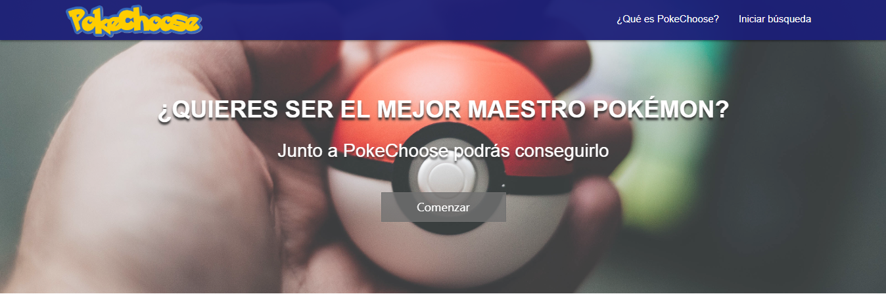

# PokeChoose 

## ¿Qué es PokeChoose?

Nace como una aplicación web que busca simular una enciclopedia virtual. PokeChoose agrupa información de los Pokémon y  le permite al usuario adentrarse en su mundo   para conocer en detalle a cada uno de la Región de Kanto.  

Para trabajar bajo los estándares de la industria, se propone el desarrollo de un producto que se encuentre centrado en el público objetivo y que busque la adaptabilidad a sus necesidades y requerimientos. 

## Planificación 

La planificación del trabajo comienza con la elección de una amplia data de la ya conocida y millones de veces descargada aplicación [Pokémon Go](https://www.pokemongo.com/es-es/). Para que esa gran cantidad de información contenida en la data sea atractiva y utilizable por los usuarios se propuso filtrarla y ordenarla de una manera amigable para quienes visiten nuestra aplicación web.

### Definición: ¿Quién es nuestro usuario? 

Lo primero y esencial es conocer al usuario. Para ello se realizó una [encuesta](https://docs.google.com/forms/d/1tS5dteTqStz4BMEkpbQ3pghEVAidVwr08N6nTFHm-xY/edit) en la que se pudo identificar: 

* La encuesta tuvo un alcance de 84 personas
* Rango de edad de nuestros usuarios: 70,2% tienen entre 21-30 años
* El 83,3% disfruta de coleccionar Pokémon, por lo que conocer en profundidad las características  de cada uno es de gran utilidad para mejorar su experiencia.  
* Cuáles son los datos de interés que desean conocer sobre Pokémon: tipo de Pokémon y sus debilidades. 
* Qué es lo que esperan de una enciclopedia de Pokémon Go 
* Qué tan necesario sería para ell@s añadir información explicativa del uso de la aplicación.

 
### 1° Fase de Prototipado

Una vez reconocido el usuario, comienza el proceso creativo compuesto por diferentes pasos que buscan dar con un resultado esperado por nosotras, pero principalmente pensado para el usuario. 

* Diagrama de flujo: esquema que grafica el flujo que debería tener nuestra aplicación, considerando cambios de interfaces y filtración de información. 

### Planificación mediante Historias de Usuario ([Trello](https://trello.com/b/7jlIokTT/data-lovers))

**¿Cuál es la necesidad de nuestro usuario?**

A partir de la encuesta realizada nacen distintas historias de usuario (**HU**)  que describen las necesidades de los usuarios, buscando cubrirlas a partir de los criterios de aceptación (**CA**) que se desarrollan en cada una de ellas.

A medida que se desarrolló PokeChoose se encontraron nuevas HU que permitieron generar una página completa y dinámica. 

1. (**HU1**): Yo como jugador principiante de Pokémon Go quiero ocupar esta aplicación desde mi computador para poder acceder a la información desde mi hogar.

(**CA**): Crear esqueleto de HTML, definiendo las pantallas de la app y sus funcionalidades.

2. (**HU2**): Yo como usuario principiante de Pokémon Go quiero poder ver todos los pokémon de la  región de kanto para poder saber cuáles son los que existen.

(**CA**): Cuando el usuario acceda a la pantalla para realizar la búsqueda, esta debe mostrar los 151 pokémon de la región de kanto.

3. (**HU3**): Yo como jugador principiante de Pokémon Go quiero filtrar los pokémon de tipo “planta” para escoger el indicado cuando tenga que enfrentarlo en una batalla con pokémon de tipo agua.

(**CA**): La página debe mostrar un selector que filtre los pokémon de acuerdo a lo que busque el usuario; en este caso que encuentre los pokémon de tipo “planta” para poder enfrentarse a los de tipo “agua”.  Este criterio nos sirve para realizar la filtración de todos los tipos.

4. (**HU4**): Yo como jugador principiante de Pokémon Go quiero saber que pokémon necesitan “50 candys” para poder alimentarlo y lograr su evolución (mejora). 

(**CA**): El jugador puede buscar a un pokémon en específico y desplegar su ficha con la información que necesita. En este caso, cuantos dulces necesita ese pokémon específicamente para evolucionar.

5. (**HU5**): Yo como jugador principiante de Pokémon Go quiero saber qué pokémon tienen como debilidad el “fuego” para poder elegir aquellos que sean más fuertes que el contrincante.  

(**CA**): La página debe tener un filtro que le permita  al usuario escoger de acuerdo a las debilidades de cada pokémon. El jugador puede seleccionar a un pokémon en específico de los que fueron filtrados por debilidad.

6. (**HU6**): Yo como jugador principiante de Pokémon Go quiero que se muestren los resultados de la selección  "distancia de huevos para encubar" para poder elegir al pokémon que más me sirva de acuerdo a la distancia en km que quiera recorrer.  

(**CA**): La página debe tener un selector que permita filtrar aquellos Pokémon  que cumplan  con la distancia que el usuario espera recorrer para encontrar  los huevos que verifiquen  la condición.  

7. (**HU7**): Yo como usuario principiante de Pokémon Go quiero ver la ficha del pokémon que seleccioné para poder conocer sus características.

(**CA**): La página debe mostrar una ficha con las características del pokémon que el usuario seleccione. La ficha debe tener una imagen para identificarlo e información de su tipo, debilidades, huevos, etc.

8. (**HU8**): Yo como jugador principiante de Pokémon Go quiero conocer cuántos pokémon tipo “agua” existen en la región de Kanto para escogerlo/capturarlo y utilizarlo en una batalla frente a los que tienen como debilidad el agua.  

(**CA**): La página muestra por medio de estadísticas el porcentaje de pokémon que son de “agua” para poder escoger al que más nos sirva para ganar estratégicamente una batalla. Esta historia aplica para obtener los porcentajes de los 18 tipos de Pokémon y generar un gráfico con esta  información. 

9. (**HU9**): Yo como jugador principiante de Pokémon Go quiero ordenar los pokémon de la A a la Z  para poder encontrarlos alfabéticamente. 

(**CA**): La página debe tener un selector que le permita  al usuario ordenar alfabéticamente (A-Z o Z-A) todos los pokémon. El jugador puede seleccionar a un pokémon en específico de los que fueron ordenados.

10. (**HU10**): Yo como jugador principiante de Pokémon Go quiero ordenar los pokémon de mayor a menor por su número para poder conocer cuáles son los últimos de la lista según su número.

(**CA**): La página debe tener un selector que le permita  al usuario ordenar de forma numérica (ascendente o descendente) todos los pokémon. El jugador puede seleccionar a un pokémon en específico de los que fueron ordenados.

11. (**HU11**): Yo como jugador principiante de Pokémon Go quiero ordenar los pokémon de menor a mayor  según el peso que tengan, para poder conocer cuáles son los más livianos de la región de Kanto. 

(**CA**): La página debe tener un selector que le permita  al usuario ordenar de forma ascendente o descendente todos los pokémon según su peso. El jugador puede seleccionar a un pokémon en específico de los que fueron ordenados.

### Segunda fase de Prototipado
### Consideraciones en el desarrollo 
### Futuras mejoras
### Autoras 